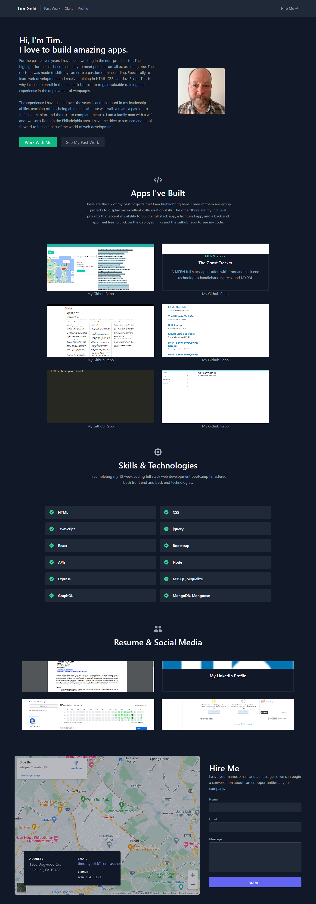

# My-Portfolio---Tim-Gold

## Description

I wanted to create a portfolio to highlight my projects, skills, link my github and linkedin. Also I wanted to tell people who I am, why I have a passion for coding, and leave a picture so they can put a face to name. This portfolio is for my future employer to see what projects I have done and my capabilities in web development. I was able to continue to heighten my skills with react. 

## Installation

Once the webpage timothyjgold.com loads you will be taken to the homescreen with options to see a picture of who I am and read a little about me as a web developer. You can click on past work to see six of my projects with a link to the deployment and the github repo. You can then click on Skills and see my listed skills or click on my Profile to download my resume or link to social media. Click the Hire Me to leave your contact info and a message for me. 

## Usage 

In order to use the web application go to: https://timothyjgold.com/

## Credits

N/A

## License

N/A

